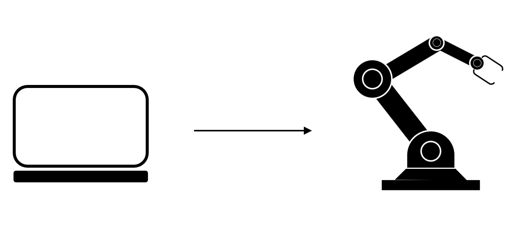
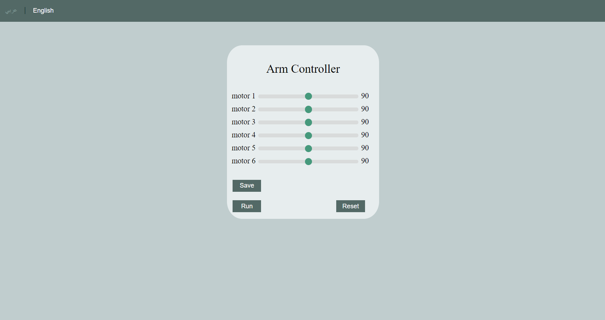
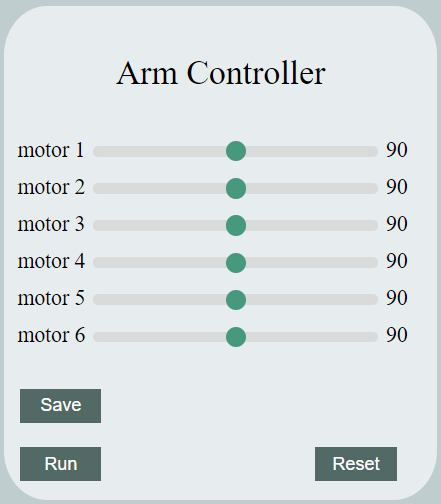
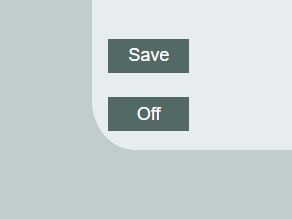

# arm-motor-control

<!-- PROJECT IMAGE -->

<!-- TABLE OF CONTENTS -->
## Table of Contents

* [About the Project](#about-the-project)
* [Interface](#interface)
* [Database](#database)
* [Implementation](#implementation)
  * [Buttons](#buttons)
  * [Files](#files)

<!-- ABOUT THE PROJECT -->
## About The Project
The aim of this project is to control a robotic arm remotely without the need for direct intervention. In order to achieve this, a web interface has been designed to helps the user control the robotic arm. Moreover, this project relied on databases in the process of communication between hardware components and commands sent from a web page by PHP.

<!-- INTERFACE -->
## Interface
The interface is designed in a simple way for ease of use. It also met the main things (such as: the angle for the six motors, run button, save button, etc.) see figure 1.

    

        figure 1: The interface for the english language.
    

<!-- DATABASE -->
## Database
This project only needs to design two tables. One is to save angles (Table 1) and the other is to save start and stop operations (Table 2).
 

 Table 1: arm angle.

| Attribute |            Description              | Datatype | PK |
|:---------:|:-----------------------------------:|:--------:|:--:|
|    id     | this id used to determine which arm |  integer | yes |
|   motor1  | the number of the angle for motor 1 |  integer | no |
|   motor2  | the number of the angle for motor 2 |  integer | no |
|   motor3  | the number of the angle for motor 3 |  integer | no |
|   motor4  | the number of the angle for motor 4 |  integer | no |
|   motor5  | the number of the angle for motor 5 |  integer | no |
|   motor6  | the number of the angle for motor 6 |  integer | no |
 

 Table 2: start/stop.

| Attribute |            Description              | Datatype | PK |
|:---------:|:-----------------------------------:|:--------:|:--:|
|    id     | this id used to determine which arm |  integer | yes |
|   on_off  |    show the last command (on/off)   |  integer | no |

<!-- IMPLEMENTATION -->
## Implementation
This section explains what each button does and explains the implementation of the files.

<!-- BUTTONS -->
### Buttons
- save button: Used to save the angles in the database (figure 2).
- reset button: Used to reset the value to the main value (figure 2).
- run/off button: Used to save the action in the database (figure 2,3).

    
     
    figure 2: buttons

    
     
    figure 2: buttons

<!-- FILES -->
### Files
- saveData.php and run.php: Used to store data in the specified table. saveData.php to store angles, and run.php to store run and stop operation.
- runInfo.php: Used to return a json file to the javascript file with information about the whether the arm is already run or not.
- response.php: Used to give information about the current arm (php page to share data with the hardware).
- armMotorControl.html: Contains the main page interface.
- armMotorControl.css: Used to improve the interface.
- armMotorControl.js: This file is responsible for converting the language of the main page (arabic/english). Moreover, it is responsible for taking the response from the runInfo.php file in order to change the necessary parts of the main page.
